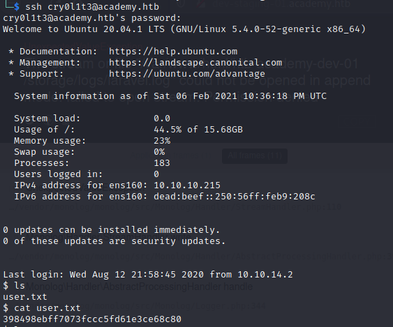

# Academy


## Contents

- [**Box**](#Box)
- [**Profile**](#Profile)
- [**Enumeration**](#Enumeration)
- [**Exploitation**](#Exploitation)
- [**Post-exploitation**](#Post-exploitation)
  - [**User**](#User)
  - [**Root**](#Root)

- [**Mitigation**](#Mitigation)


## Box

 


## Profile

[](https://www.hackthebox.eu/home/users/profile/419539)


## Enumeration

First, i start with `nmap`:

 


Before caring about ssh, i always start with http port, so i went to the website and there was login/register page. I created an account and went to the home.php. There were nothing interesting so I start the `gobuster` scan to list directories and got the **admin.php**.   I needed authentication so i tried admin:admin first, default creds in many web applications, but it didn't work. I decided to see the **HTTP response header** of the **register.php** with `Burp Suite` and i noticed the `roleid` parameter. The default value was 0, i tried to edit this value to 1 before sending the request to the server (I hoped the admin roleid was 1 and i was lucky, otherwise i would brute force with burp the id):

 

I tried to authenticate again with creds i gived on the registered and it worked:

 


First, i noticed the potential usernames **cry0l1t3** and **mrb3n** which i noted in a info.txt file. After that, i went on **dev-staging-01.academy.htb** subdomain. I got 500 server error which give us several informations, like the application used: ***Laravel***


## Exploitation

I don't have any info about the version of *Laravel* used but i search if any exploit exist with the `searchsploit` command:

 

There are two *Remote Code Execution*, i started to use the metasploit module first. In the options, it required the **APP_KEY** which i did see on the subdomain page:

 


I runned the exploit and got  a shell:

 


## Post-exploitation

### User

I typed `pwd` to see where we are and we are in **/var/www/html/dev-staging-01.academy.htb/public/**. I went to the directory before and cat **.env** file, i got some information like **APP_KEY** or **DB_PASSWORD** which were in the webpage. When i went to the **/var/www/html/** directory, i noticed **academy** directory which is the main domain web server and it contained similar file. I cat **.env**   file and got new password:

 


I went to the **/home/** directory to list users and there were lot of users: 

- cry0l1t3
-  mrb3n
- 21y4d
- egre55
- g0blin
- ch4p

I remembered the users **cry0l1t3** and **mrb3n** which i did see on the admin page and i decided first to try the new password with **cry0l1t3** to get ssh connection:

```bash
ssh cry0l1t3@10.10.10.215
```

After entered the password i got the connection:

 


### Root

I first did `sudo -l` to see if **cry0l1t3** had sudo rights but he did not, so i started a *linpeas* enumeration and i found **mrb3n** password:

 


Using `sudo mrb3n`, i switch account with this password. I did `sudo -l` again to see if **mrb3n** had sudo rights and this time he did. He had sudo right in `composer` command. After searching method to get shell with this command, i found a nice one:

 

I tried this following commands:

```bash
TF=$(mktemp -d)
echo '{"scripts":{"x":"/bin/sh -i 0<&3 1>&3 2>&3"}}' >$TF/composer.json
sudo composer --working-dir=$TF run-script x
```

 

And i got a shell with **root** privilege:

  


## Mitigation

To avoid this kind of vulnerabilities, it is recommended to :

- Handle user creation safely
- Not display server side error informations as 500 status code
- Remove all connection logs like `su <user>`
- Never give **sudo** or **SUID** rights to commands witch can allow **privilege escalation**