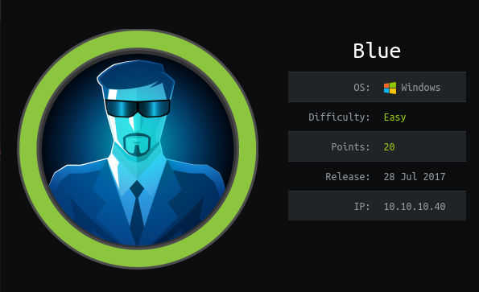
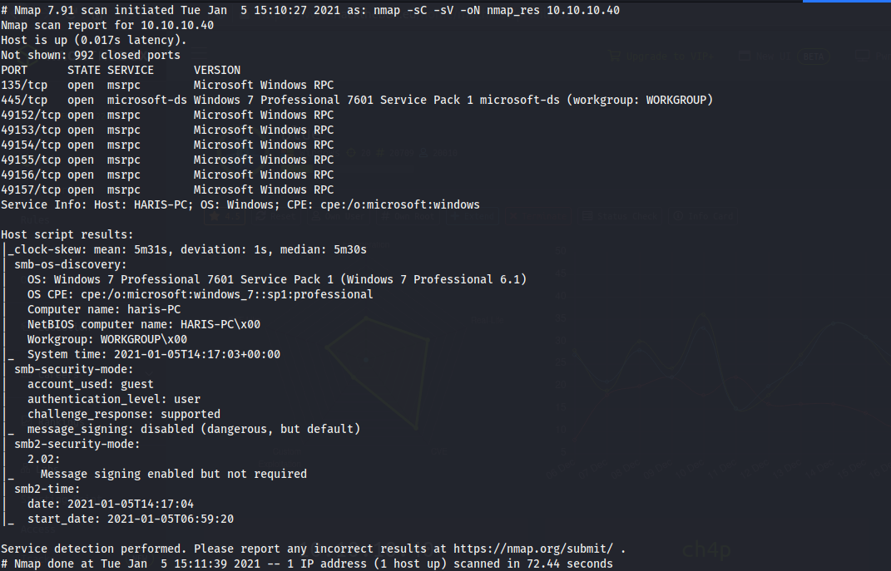
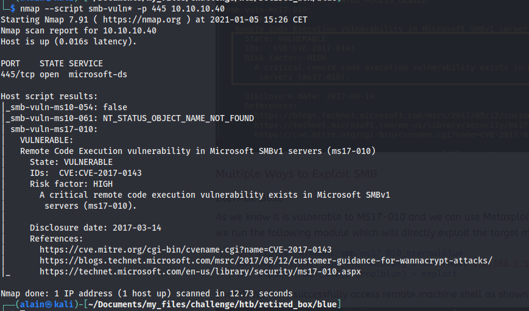
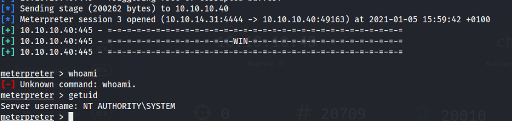
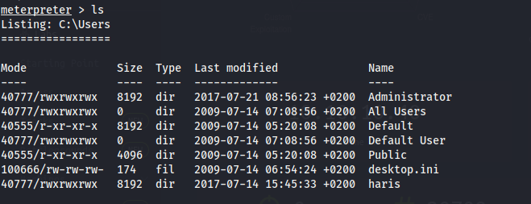
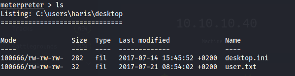
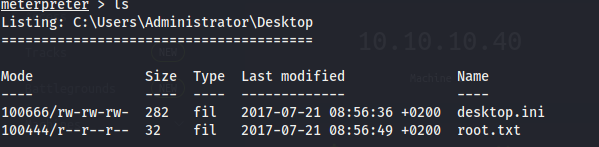

# Blue

## Contents

- [**Box**](#Box)
- [**Profile**](#Profile)
- [**Enumeration**](#Enumeration)
- [**Exploitation**](#Exploitation)
- [**Post-exploitation**](#Post-exploitation)
  - [**User**](#User)
  - [**Root**](#Root)

- [**Mitigation**](#Mitigation)

## Box

 

## Profile

## Enumeration

First, nmap scanning:

 

The first thing i do when i see the smb service available is to check vulnerability with `nmap --script`:

 

Here, i found that it is vulnerable to `ms17-010` which refers to **eternalblue** (Box name was a hint).  

## Exploitation

So, i started **metasploit** and used the **eternalblue** module: `use exploit/windows/smb/ms17_010_eternalblue` 

I used the meterpreter payload to get a better shell: `windows/x64/meterpreter/reverse_tcp`

I got it with the highest privilege on windows which is `nt authority\system`:

 

## Post-exploitation

As i had the highest privilege, i could get all users flag. I listed users:

 

### User

 

### Root

 

## Mitigation

To avoid this vulnerability, it is recommended to upgrade the system in his latest version.