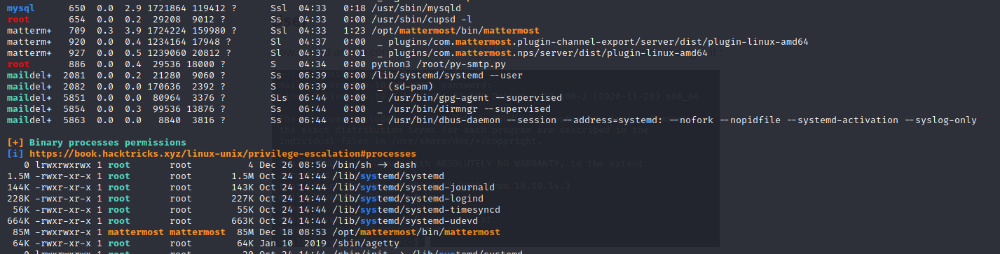

# Delivery


## Contents

- [**Box**](#Box)
- [**Profile**](#Profile)
- [**Enumeration**](#Enumeration)
- [**Exploitation**](#Exploitation)
- [**Post-exploitation**](#Post-exploitation)
  - [**User**](#User)
  - [**Root**](#Root)


## Box

 


## Profile

[](https://www.hackthebox.eu/home/users/profile/419539)


## Enumeration

First of all as every time, nmap scan :

 


I went to the webpage and tried to find some hints :

 

So, i have to create an email using the helpdesk page. 

After created my ticket, i went to the mattermost page to create new account using the generated email (**TICKET_NUMBER@delivery.htb**)

It sent a mail to the ticket page to validate the subscription :

 


Now, i can authenticate myself to the mattermost page :

 


## Exploitation

In the main channel of mattermost, i found interesting informations about potential credentials :

1. The credentials to connection in the server : `maildeliverer:Youve_G0t_Mail!`
2. Hint to probably crack hash later : `PleaseSubscribe!` 

 


## Post-exploitation

### User

Now, i tried an ssh connection to the maildeliverer user with his password, and i got it :

 


### Root

After using enumeration tool as **linPEAS**, i searched any hint that can make me able to privesc, and i remembered that the server uses mattermost, so i searched all things about it in the linpeas result and finally, i found the mattermost repository int the **/opt** directory :

 


After that, i found the **config.json** file that contained credentials to connect to mysql server : `mmuser:Crack_The_MM_Admin_PW`

 

One more hint : i need to find mattermost admin password and crack it to be able to connect to root.


With this informations, i tried to connect to mysql with the indicated credentials : `mysql -u mmuser -p`

 


I listed all databases with the following command : `show databases;`

Used the mattermost database : `use mattermost;`

Listed usernames and password of the Users table (`show tables;` to list all tables) : `select Username,Password from Users`

I finally got the root hash :

  


Now, i just have to crack this password using the hints i found earlier and hashcat rules attack.

I copied the hash to a file that i named *hash* in my local machine. I also tried to get information about the hash format and i found that it is a bcrypt using online hash analyzer : <https://www.tunnelsup.com/hash-analyzer/> 

After that, i searched in google how to use hashcat rules with **PleaseSubscribe!** pattern and i found the correct command to generate the corresponding wordlist :

First, i create a file called *rule* and contained **PleaseSubscribe!** 

After that, i created the wordlist with the following command :

```bash
hashcat -r /usr/share/hashcat/rules/best64.rule --stdout rule > wordlist.txt
```

It generated a wordlist as the following :

 

At the end, i executed the hashcat command, cracked the hash and found that password was **PleaseSubscribe!21** :

```bash
hashcat -m 3200 -a 0 hash wordlist.txt
```

 

Finally, i tried to connect to root with this password and got it : `su - root`

 


