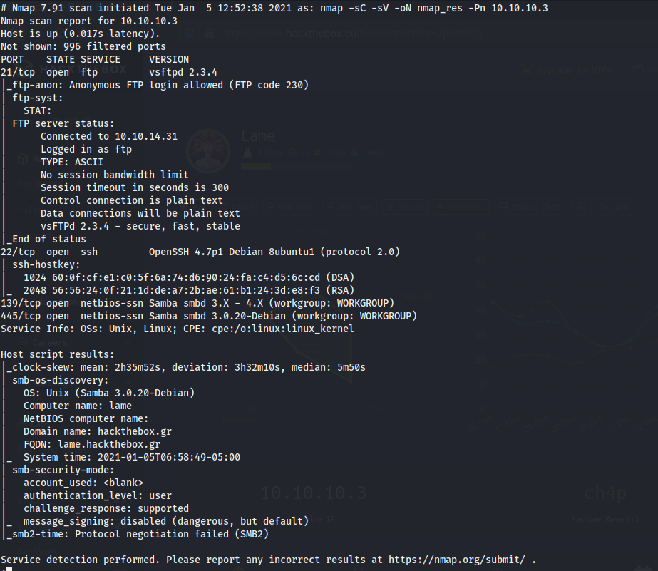
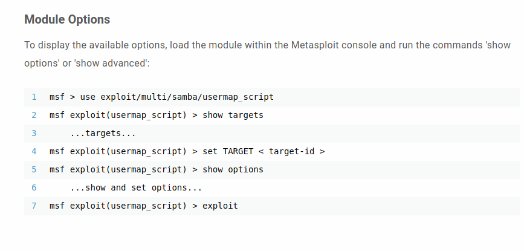
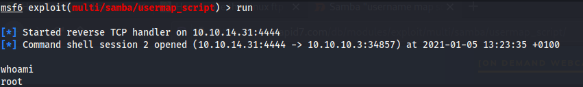
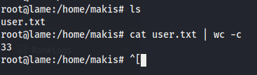
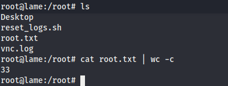

# Lame

## Contents

- [**Box**](#Box)
- [**Profile**](#Profile)
- [**Enumeration**](#Enumeration)
- [**Exploitation**](#Exploitation)
- [**Post-exploitation**](#Post-exploitation)
  - [**User**](#User)
  - [**Root**](#Root)

- [**Mitigation**](#Mitigation)

## Box

 

## Profile

## Enumeration

First, nmap scanning:

 

There are several services used. I focused on the smb service and searched `Samba smbd 3.0.20-Debian exploit` on google and i got an **rce** exploit in this version from **rapid7** website: `'Username' map script' Command Execution`

 

## Exploitation

I used the previous exploit in **metasploit**. After setting all options, i did run it and got a simple shell with root privileges:

 

## Post-exploitation

After this, i had the highest privileges of the system so i could get users flag easily.

### User

 

### Root

 

## Mitigation

To avoid this exploit, it is recommended to upgrade and patch the system.