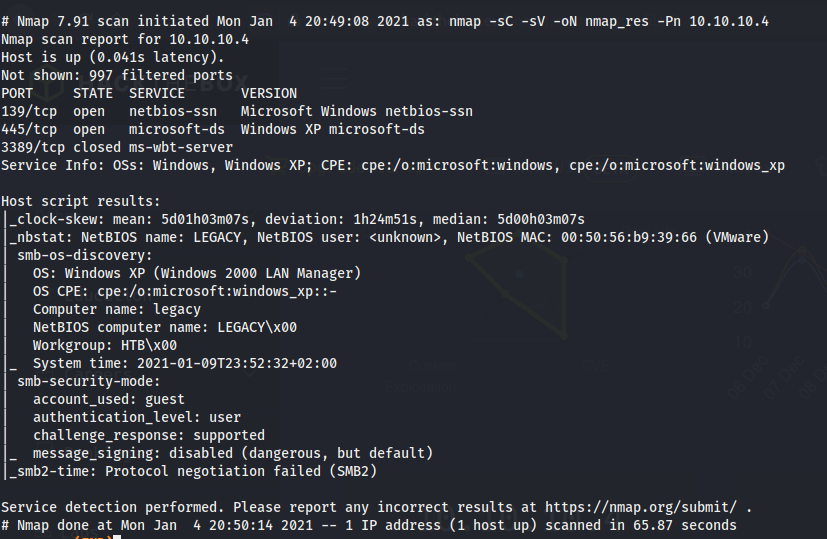
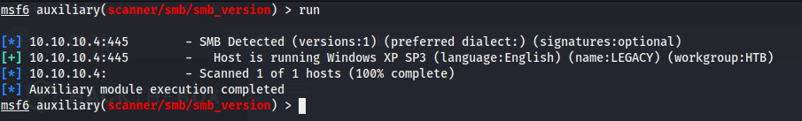
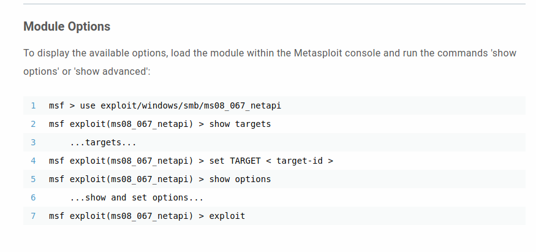
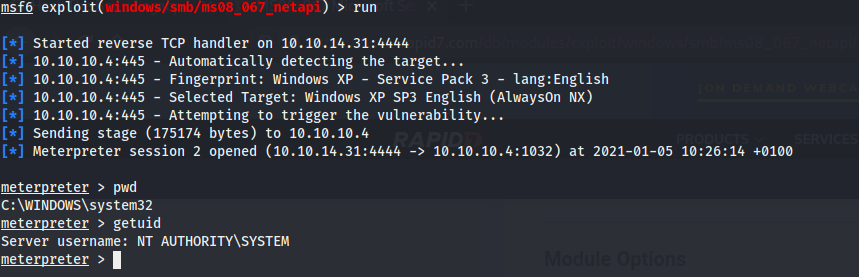
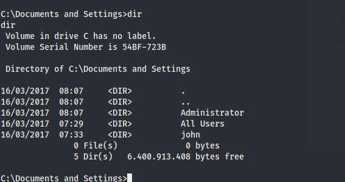
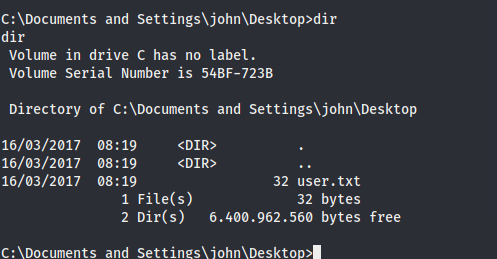
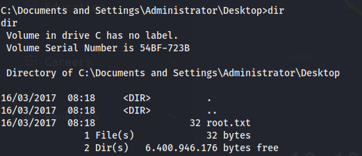

# Legacy

## Contents

- [**Box**](#Box)
- [**Profile**](#Profile)
- [**Enumeration**](#Enumeration)
- [**Exploitation**](#Exploitation)
- [**Post-exploitation**](#Post-exploitation)
  - [**User**](#User)
  - [**Root**](#Root)

- [**Mitigation**](#Mitigation)

## Box

 

## Profile

## Enumeration

First, i start with nmap scanning:

 

Here, we have a **Windows XP** which use **smb** service. I start **metasploit** to scan the smb version using `scanner/smb/smb_version` module:

  

I got some informations and i start to search on google `Windows XP SP3 exploit`. I found an exploit from **Rapid7** website in first result:

  

## Exploitation

I set the previous exploit on my **metasploit**, set all options and run. After that, i got a meterpreter and on top of that, i had the highest privilege on windows which is `nt authority\system`:

 

## Post-exploitation

As i had the highest privilege, i could get all users flag. So, i listed users and got it:

 

### User

 

### Root

 

## Mitigation

To avoid the `ms08_067` exploit, it is recommended to upgrade and patch the system.