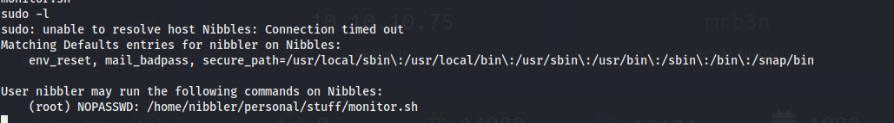

# Nibbles


## Contents

- [**Box**](#Box)
- [**Profile**](#Profile)
- [**Enumeration**](#Enumeration)
- [**Exploitation**](#Exploitation)
- [**Post-exploitation**](#Post-exploitation)
  - [**User**](#User)
  - [**Root**](#Root)

- [**Mitigation**](#Mitigation)


## Box

 


## Profile

[](https://www.hackthebox.eu/home/users/profile/419539)


## Enumeration

First, nmap scanning:

 


I went to the webpage and it just printed **"hello world"**, i looked at the source page and i found an interesting comment:

 

I added this directory to the url and a blog appeared. I decided to enumerate this directory with **gobuster** to get more information:

```bash
 gobuster -o gobuster_res dir -u http://10.10.10.75 -w /usr/share/seclists/Discovery/Web-Content/common.txt
```

 


The `/admin` page allowed directory listing:

   

But i found nothing interesting here. I went to the `/admin.php` file and an authentication was required. After brute forcing, i didn't find valid credentials and i was banned temporarily, so i stopped to brute force.

  

## Exploitation

When i was  reading the `README` file, i found that the version of `nibbleblog` installed is 4.0.3:

 

I used **searchsploit** to see if vulnerabilities exist on this version and it does:

  

A remote code execution is possible on this version but we need to get authenticated.

As brute forcing was not the solution, i thought that there was hint for the admin password. The box name is **Nibbles** and in the main blog page, the title is the same thing, so i tried `admin:nibbles` credentials and it worked:


 


## Post-exploitation

### User

I started **metasploit** and search the exploit module: `exploit/multi/http/nibbleblog_file_upload`

  

After setting all options, i did run the exploit and got the meterpreter:

 


I got the user flag:

 


### Root

First, i used the following command to list all root privileges command the user can do:

 ```bash
sudo -l
 ```

  

 


Here, i can use the `sudo` privilege on `home/nibbler/personal/stuff/monitor.sh`.

The directory is in zip format:

 

 But i didn't unzip it, i had the idea to create my own script with the same path. As the script is run with `sudo`, the command executed in the script has root privileges. So, i create the directories with:

```bash
mkdir -p personal/stuff
```

I go to the stuff directory and create the `monitor.sh` file with just a interactive bash command:

 

I made it executable with:

```bash
chmod +x monitor.sh
```

And i execute the the script. We got the interactive bash shell with root:

 


## Mitigation