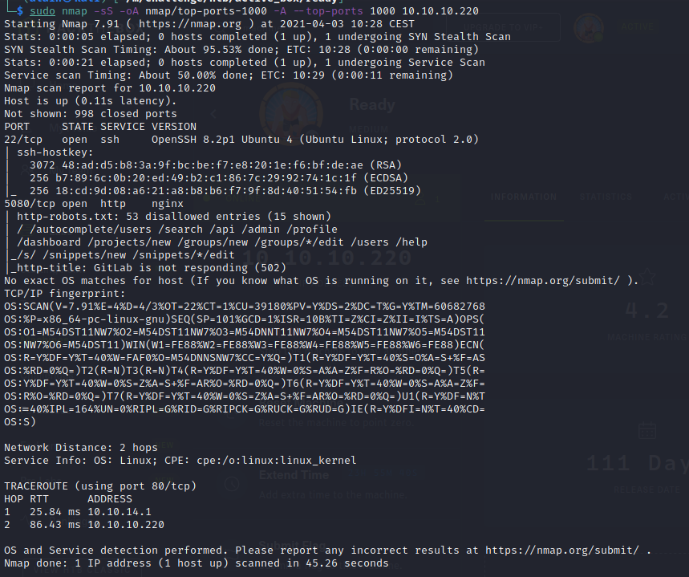
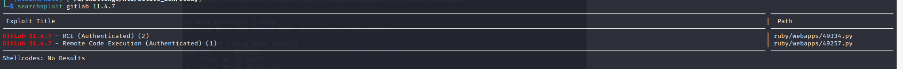
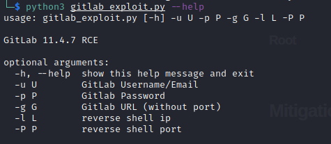
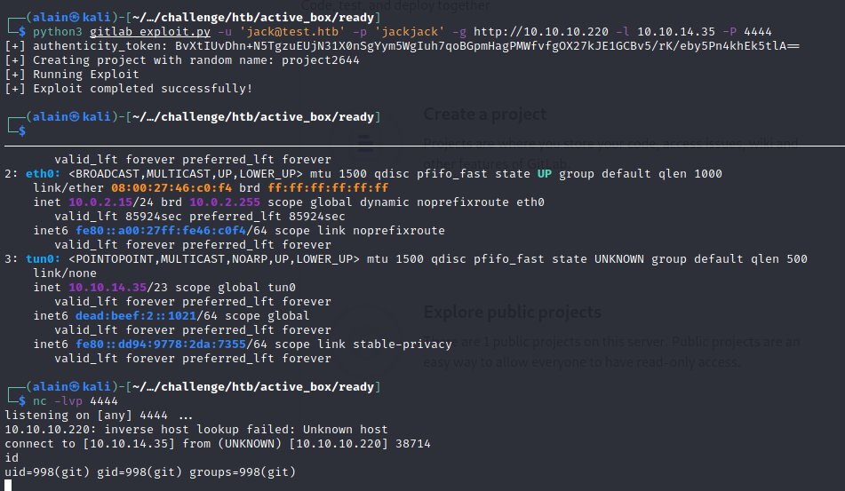
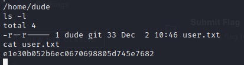
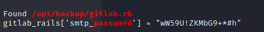
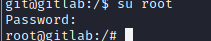
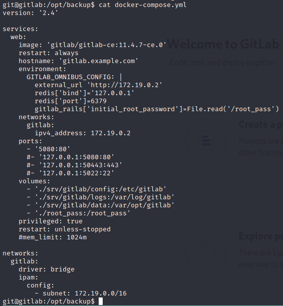
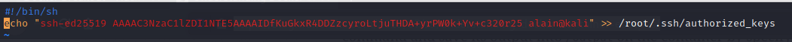
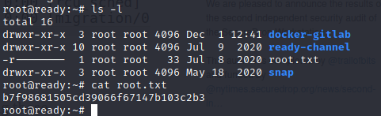

# Ready


## Contents

- [**Box**](#Box)
- [**Profile**](#Profile)
- [**Recon**](#Recon)
- [**Exploitation**](#Exploitation)
- [**Post-exploitation**](#Post-exploitation)
  - [**Root**](#Root)


## Box

 


## Profile

[](https://www.hackthebox.eu/home/users/profile/419539)


## Recon

We start with `nmap` scanning :

 

**HTTP** server is running on port 5080, so i decided to look what there were in and we got a **gitlab** server. I created an account and looked at the gitlab version :

  

This version is out of date and has known critical vulnerabilities. I found a **RCE** exploit using `searchsploit` :

 

## Exploitation

Then, i copied the first one in my current directory :

```bash
searchsploit -m ruby/webapps/49334.py
```

I renamed it and looked how i have to use it with the `--help` option :

 

Thus, i started my netcat and runned the exploit with the account i created before and got a shell :

 

## Post-exploitation

### Root

We got the user flag because  :

 

In the root directory `/`, i found a docker environment variable setup file which means that we are in a docker container and that we have to find a way to breakout it. 

After few searches, i decided to start a **linpeas** and found a password :

  

Trying this password to connect as the root user, it worked :

 

Now, we have to find if it is possible to use a docker-container-escapes exploit. The docker container needs to be run with `--privileged` option. After a quick search, i found the docker config file in `/opt/backup/docker-compose.yml` :

  

We can see the `privileged` parameter which is set to `true`. So i decided to use the following exploit : <https://blog.trailofbits.com/2019/07/19/understanding-docker-container-escapes/>

I applied all steps and make my payload which consists to just copy my **ssh** public key to the root authorized_keys :

 

I executed the exploit and succeeded to connect to the root with ssh. I got the root flag :

 